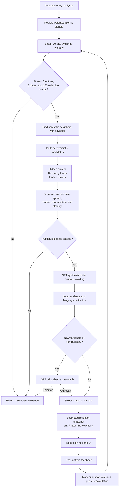
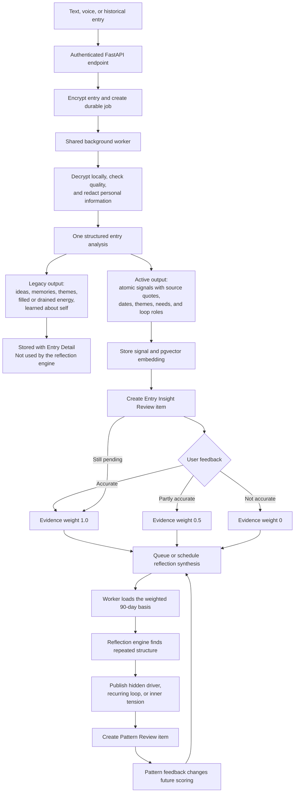

# Orion Mind

Orion Mind is a private journal that looks for patterns across what a person writes over time. A journal entry can begin as text or a voice recording. Orion stores it securely, extracts useful signals, lets the person correct those signals, and builds cautious reflections such as hidden drivers, recurring loops, and inner tensions.

This repository contains the web app, API, database migrations, and background worker. The reflection features are guarded by feature flags and a user rollout list, so a local installation needs more than the frontend alone.

## Try it live

Open [orionmind.in](https://www.orionmind.in) and sign in with the demo account:

- **Email:** `snevandan27@gmail.com`
- **Password:** `Sneha@#2019`

## What works today

| Area             | Current state                                                                                                                                                                                     |
| ---------------- | ------------------------------------------------------------------------------------------------------------------------------------------------------------------------------------------------- |
| Account access   | Supabase email/password sign-up, login, email confirmation, password recovery, protected routes, and session refresh are connected.                                                               |
| Journal entries  | The app can save encrypted text drafts, submit text, transcribe voice with Whisper, list entries, show entry details, and retry failed processing. The API also accepts dated historical entries. |
| Entry processing | A durable worker checks entry quality, redacts personal information locally, classifies themes, stores ideas, memories, three per-entry reflection fields, atomic signals, and signal embeddings. |
| Review           | The `/review` page and backend API are connected. People can confirm, partly confirm, reject, correct, or annotate entry insights and synthesized patterns. `/approvals` redirects here.          |
| Reflections      | The backend can build and serve a 90-day reflection snapshot, accept pattern feedback, and queue recalculation. The engine and API are off by default and limited to configured rollout users.    |
| Journey          | The timeline, chapters, and theme river are implemented as a UI demonstration, but the screen currently reads fixtures rather than the backend.                                                   |
| Profile          | The backend has profile and account-deletion endpoints. The current profile screen still uses an in-memory repository, so profile edits in that screen are not durable.                           |

Ideas, memories, and the older `filled_energy`, `drained_energy`, and `learned_about_self` fields are stored and shown with an entry. They are not the evidence source for longitudinal reflections. The active reflection path uses atomic signals and their Review feedback.

## How the reflection engine works

The engine does not ask a model to read a journal and freely invent a personality summary. Code first builds a bounded evidence set, scores possible patterns, and only sends eligible candidates for wording. The result is checked against the original evidence before it can be published.



The current configuration uses GPT-5.6 Luna for entry analysis, `text-embedding-3-small` for signal embeddings, GPT-5.6 Terra for synthesis, and GPT-5.6 Sol when a critic is needed. Model names can be changed through backend settings.

## How a new entry becomes a recurring insight

A pending Review item starts with evidence weight `1.0`. Confirming it keeps that weight, partial confirmation changes it to `0.5`, and rejection changes it to `0`. This means Review is a correction loop, not a strict approval gate before the engine sees a signal. Every changed verdict advances the reflection source version, makes the old snapshot stale, and requests worker recalculation.



## Project layout

```text
src/app/                 Next.js routes and layouts
src/features/            Entries, Review, Reflections, Journey, Profile, and Auth
src/components/          Shared UI, layout, feedback, and design-system components
backend/app/modules/     FastAPI feature modules and the reflection engine
backend/migrations/      PostgreSQL, row-security, queue, pgvector, and Review changes
backend/scripts/         Migration, worker, evaluation, and test entry points
e2e/                     Playwright browser tests
docs/                    Product, design-system, API, and reflection notes
```

The frozen API contract is in [`backend/docs/contracts/profile-entry-v1.openapi.yaml`](backend/docs/contracts/profile-entry-v1.openapi.yaml). The detailed reflection rules are in [`docs/Reflection-Algorithm.md`](docs/Reflection-Algorithm.md).

## Tools and libraries

- The frontend uses Next.js 16, React 19, TypeScript, Tailwind CSS 4, Radix UI, TanStack Query and Table, React Hook Form, Zod, and the Supabase JavaScript client.
- The backend uses Python 3.11, FastAPI, Pydantic, SQLAlchemy, psycopg, PostgreSQL/Supabase, pgvector, and the OpenAI Python SDK.
- Privacy and media handling use AES-GCM through PyCryptodome, Microsoft Presidio, spaCy, FFmpeg, and ffprobe.
- Tests and checks use Vitest, Testing Library, Playwright, pytest, Ruff, mypy, ESLint, Prettier, and the repository's design-system checker.
- Optional production telemetry uses OpenTelemetry. The frontend and API can be deployed separately; Railway configuration is included for the API and worker.

## Local setup

You will need Node.js 22 or newer, npm, Python 3.11, a Supabase/PostgreSQL project, and FFmpeg for voice entries.

Install the frontend and backend dependencies:

```bash
npm ci
cd backend
python3.11 -m venv .venv
.venv/bin/python -m pip install -r requirements-dev.txt
cd ..
```

Create local environment files:

```bash
cp .env.example .env
cp backend/.env.example backend/.env
```

The root file needs the public Supabase URL, public key, and backend URL. The backend file documents the Supabase credentials, separate application and worker database URLs, OpenAI settings, encryption keys, CORS, and reflection flags. Do not place server secrets in the root `.env`.

Migrations never run automatically. Apply them with a migration-owner connection:

```bash
cd backend
ORION_MIGRATION_DATABASE_URL='<migration-owner-url>' \
  .venv/bin/python scripts/migrate.py
cd ..
```

Run the three processes in separate terminals:

```bash
# Terminal 1
npm run dev

# Terminal 2
npm run backend

# Terminal 3
cd backend
.venv/bin/python scripts/run_processing_worker.py
```

The web app runs at `http://localhost:3000` and the API defaults to `http://127.0.0.1:8000`. Set `ENABLE_API_DOCS=true` outside production to expose local Swagger at `/docs`.

Review and Reflections also require the engine, scheduler, and API flags, `publish` rollout mode, and the signed-in user's UUID in `REFLECTION_ROLLOUT_USER_IDS`. See [`backend/.env.example`](backend/.env.example) for the exact names.

## Checks

Run the required frontend checks from the repository root:

```bash
npm run typecheck
npm run lint
npm test
npm run build
```

Run backend tests without live Supabase calls:

```bash
cd backend
.venv/bin/python -m pytest -m "not live_supabase"
```

Browser tests are available through `npm run test:e2e`. Some live and end-to-end reflection tests need dedicated credentials, database roles, and model access; the default test command does not create those services for you.
