# Reflection API testing pipeline

## Purpose

This document traces the current Reflection API from journal ingestion to
`GET /api/v1/reflections`, and defines the evidence required to test each
boundary. It is based on the current code, `docs/Reflection-Algorithm.md`, and
`docs/Reflection_Implementation.md`.

The longitudinal Reflection Engine is separate from the entry-level
`public.reflections` extraction rows used by Review. The aggregate endpoint
reads immutable reflection snapshots and may idempotently request asynchronous
synthesis; it does not call an LLM inside the HTTP request.

## Current implementation map

```mermaid
flowchart TD
    Entry["Authenticated entry API<br/>POST /api/v1/entry<br/>POST /api/v1/entries/voice<br/>POST /api/v1/past-entries"]:::implemented
    Store["Canonicalize and AES-GCM encrypt content<br/>Store entry and pending entry_processing job"]:::implemented
    Worker["Shared PostgreSQL worker<br/>claim with SKIP LOCKED<br/>pending to running"]:::implemented
    Decrypt["Decrypt locally"]:::implemented

    Entry --> Store --> Worker --> Decrypt

    Decrypt --> Quality["Deterministic quality features<br/>duplicate, noise, meaningful content"]:::implemented
    Decrypt --> Redaction["Local PII detection and redaction<br/>Presidio and spaCy"]:::implemented
    Decrypt -.-> Safety["Standalone safety-screening service<br/>not implemented"]:::skipped

    Quality --> Luna["Combined GPT-5.6 Luna analysis<br/>quality, legacy extraction, themes, signals"]:::substitute
    Redaction --> Luna
    Safety -. "safe_for_pattern_analysis plus local validators" .-> Luna

    Luna --> Decision{"Final local eligibility"}:::implemented
    Decision -->|"uncertain or excluded"| NoSignals["Store entry_analysis<br/>Store no reflection signals"]:::implemented
    Decision -->|"accepted"| Embeddings["Batch accepted redacted signal summaries<br/>OpenAI embedding, fixed 1,536 dimensions"]:::implemented
    Embeddings --> Signals["Store entry_analysis, entry_signals and pgvector embeddings<br/>atomically with exact original offsets"]:::implemented
    Signals --> Counters["Update reflection_user_state counters"]:::implemented
    Luna --> Legacy["Store ideas, memories, themes and<br/>entry-level reflections"]:::implemented
    Legacy --> ReviewRows["Pending approval rows in PostgreSQL"]:::implemented

    ReviewUI["/approvals frontend"]:::substitute
    ReviewUI --> MockStore["In-memory mock review repository"]:::substitute
    ReviewRows -. "no production review API" .-> MockStore
    MockStore -. "does not affect longitudinal signals" .-> Signals

    Counters --> Scheduler{"Worker scheduler after 18:00<br/>in profile timezone"}:::implemented
    Counters --> APIRequest{"Authenticated Reflection GET<br/>eligible newer basis?"}:::implemented
    Scheduler -->|"disabled, outside cohort, already checked,<br/>or insufficient counters"| Wait["No synthesis job"]:::implemented
    Scheduler -->|"eligible"| SynthesisJob["Enqueue reflection_synthesis<br/>in processing_jobs"]:::implemented
    APIRequest -->|"eligible"| SynthesisJob

    SynthesisJob --> SameWorker["Same shared worker"]:::substitute
    SameWorker --> Basis["Load fixed 90-day accepted-signal basis"]:::implemented
    Basis --> Candidates["Deterministic candidate construction<br/>scores, thresholds, evidence links"]:::implemented
    Candidates --> Terra["GPT-5.6 Terra constrained synthesis"]:::implemented
    Terra --> CriticRule{"Within 0.05 of threshold<br/>or contradiction at least 0.20?"}:::implemented
    CriticRule -->|"yes"| Sol["GPT-5.6 Sol publish/discard critic"]:::implemented
    CriticRule -->|"no"| Validation["Local validation"]:::implemented
    Sol --> Validation
    Validation -->|"valid"| Snapshot["Versioned snapshot, insights and evidence"]:::implemented
    Validation -->|"unsupported"| Discard["Discard proposal and record safe reason code"]:::implemented

    Snapshot --> API["Authenticated GET /api/v1/reflections?range=7d|30d|all<br/>private, no-store; async request only"]:::implemented
    API --> Screen["Reflection screen"]:::implemented

    classDef implemented fill:#dcfce7,stroke:#15803d,color:#14532d
    classDef substitute fill:#fef3c7,stroke:#b45309,color:#78350f
    classDef skipped fill:#fee2e2,stroke:#b91c1c,color:#7f1d1d
```



Mermaid is the selected free visualization tool. It is versionable, renders in
GitHub-compatible Markdown viewers, and requires no account or credentials.

## Step-by-step execution contract

| Step                       | Current boundary                                | Expected observable result                                                                                                   | Persistent effect                                                                             | Model     |
| -------------------------- | ----------------------------------------------- | ---------------------------------------------------------------------------------------------------------------------------- | --------------------------------------------------------------------------------------------- | --------- |
| 1. Authenticate            | `ProtectedAPIRoute` and Supabase bearer token   | Owner UUID is derived from the verified token; no request owner field is accepted                                            | None                                                                                          | None      |
| 2. Submit                  | Entry controllers and `EntryService`            | Text/voice returns 201; historical entry returns 202                                                                         | Encrypted `entries` row and one idempotent `entry_processing` job                             | None      |
| 3. Claim                   | `JobService.run_one` and `claim_processing_job` | Oldest eligible job becomes `running`; attempts, worker ID, claim token and heartbeat are set                                | Entry becomes `processing` under the same claim                                               | None      |
| 4. Decrypt                 | `JobService._dispatch` and `ContentCipher`      | Plaintext exists only inside the worker process                                                                              | None                                                                                          | None      |
| 5. Deterministic quality   | `processing/quality.py`                         | Word/token ratios, keyed n-gram sketch, duplicate checks and hard exclusion codes are computed                               | Included in `entry_analyses`                                                                  | None      |
| 6. Redact PII              | `processing/redaction.py`                       | Stable per-user placeholders, encrypted vault, redacted text and an exact offset map are produced                            | `user_pii_vaults` and encrypted analysis fields                                               | None      |
| 7. Analyze                 | `OpenAIEntryAnalysisProvider`                   | Strict `ModelEntryAnalysis` response; provider storage and SDK retries are disabled                                          | No write until local validation passes                                                        | Luna      |
| 8. Bind and validate       | `ProcessingService.analyze`                     | Quotes are rebound to exact redacted spans, final eligibility is recalculated, and offsets map back to exact original slices | Prepared analysis, signals and legacy extraction                                              | None      |
| 8a. Embed accepted signals | `OpenAISignalEmbeddingProvider`                 | One fixed 1,536-dimension vector is returned for each accepted redacted signal summary; excluded content makes no call       | Prepared vectors only; no write before the claim-bound transaction                            | Embedding |
| 9. Apply atomically        | processing repository and claim-bound RPCs      | Claim is current and analysis plus vector persistence commit or roll back together                                           | Completed entry, analysis, accepted signals, embeddings, legacy rows, counters, completed job | None      |
| 10. Schedule               | `JobService.schedule_reflections`               | At or after local 18:00, one daily check enqueues at most one synthesis job for the latest accepted source version           | `last_schedule_local_date` and possibly `reflection_synthesis` job                            | None      |
| 10a. Request on read       | `ReflectionsService.read`                       | An eligible newer basis creates or expedites one idempotent synthesis job with `run_after=now()`                             | At most one `reflection_synthesis` job per owner and source version                           | None      |
| 11. Build candidates       | `ReflectionEngineService.construct_candidates`  | Hidden-driver, loop and tension candidates receive deterministic scores, gates and evidence links                            | Applied with the snapshot, or counted only in shadow mode                                     | None      |
| 12. Synthesize             | `OpenAIReflectionProvider.synthesize`           | Strict proposals may use only supplied candidate/signal IDs and must cite every supplied reference                           | No write until validation                                                                     | Terra     |
| 13. Critique conditionally | `critic_required`                               | Borderline or contradictory candidates receive publish/discard only                                                          | No direct write                                                                               | Sol       |
| 14. Validate               | `EvidenceValidator`                             | Ownership, dates, offsets, exact quotes, roles, counterevidence, dominance and safe language pass                            | Unsupported proposals are discarded, never repaired                                           | None      |
| 15. Snapshot               | `apply_reflection_snapshot`                     | A versioned immutable snapshot contains available or explicit insufficient sections                                          | Candidate lifecycle, insights, evidence, state counters and completed synthesis job           | None      |
| 16. Read                   | `ReflectionsService.read`                       | Strict aggregate response for `7d`, `30d` or `all`; latest successful snapshot may be stale while refresh is pending/failed  | Idempotent queue request plus persisted aggregate read                                        | None      |

## Scheduler rules currently implemented

The database derives recalculation eligibility from persisted accepted
analyses and signals newer than the last successful snapshot. It does not trust
the denormalized counters alone. A refresh is eligible when at least one new
accepted signal exists and any one of these conditions is true:

- at least three valid entries are new;
- at least 500 reflective words are new; or
- at least one valid entry has been pending for three days.

The first snapshot instead retains the global 90-day basis gate of at least
three valid entries, two distinct entry dates, and 200 reflective words. Both
the local-18:00 scheduler and authenticated aggregate-read request use this one
database predicate. The read path calls a worker-only atomic request function,
so it may expedite an eligible pending job but cannot bypass the thresholds or
create duplicate jobs under replay.

The independent weekly trigger remains deferred. Newly processed accepted
signals are stored as fixed 1,536-dimension pgvector embeddings; upgrade rows
remain nullable and are not automatically re-embedded.

## Aggregate GET states

`GET /api/v1/reflections?range=<7d|30d|all>` is authenticated, owner-derived,
and performs no inline model call. It may idempotently request asynchronous
synthesis through the shared worker and returns `Cache-Control: private,
no-store`.

| Condition                                  | HTTP | Reflection state                  | Processing state |
| ------------------------------------------ | ---: | --------------------------------- | ---------------- |
| Latest successful snapshot                 |  200 | `available`                       | `idle`           |
| First synthesis pending/running            |  200 | `first_reflection_pending`        | `pending`        |
| New accepted entries after snapshot        |  200 | `stale`                           | `pending`        |
| Refresh failed but old snapshot exists     |  200 | `stale`                           | `failed`         |
| No accepted reflective basis               |  200 | `insufficient_reflective_content` | `idle`           |
| No snapshot and terminal technical failure |  503 | `technical_failure`               | `failed`         |

Each section is independently `available` or `insufficient_evidence`.

## Test harness

The committed harness is
`backend/scripts/run_sample_reflection_e2e.py`. A canonical run must:

1. validate exactly 30 unique June 2026 inputs and record the dataset SHA-256;
2. verify frontend/backend test credential and Supabase project parity;
3. sign in without logging credentials, email, token or raw user UUID;
4. verify model access before sending journal content;
5. fail closed unless the dedicated test user is empty;
6. submit entries one by one through `POST /api/v1/past-entries`;
7. run the production worker until all entry jobs are terminal;
8. run the production scheduler once at a controlled post-18:00 timestamp;
9. call the aggregate GET to expedite the scheduled job to `run_after=now()`;
10. drain the synthesis job through the same worker and schema-validate the final aggregate GET;
11. capture safe per-entry stage results, model usage, candidate outcomes,
    validator discard reasons and database effects; and
12. write the result atomically without secrets or raw journal content.

The per-entry human-readable findings belong in
`docs/reflection-indepth-breakdown.md`. The machine result belongs in
`data/sample-reflection-result.json` only after a canonical live run succeeds.

## Offline fixture runner

`backend/scripts/run_sample_reflection_offline.py` is the safe, non-networked
feedback loop for the same 30-entry dataset. It uses the production
deterministic quality, candidate scoring, proposal materialization, evidence
validation, critic routing, and snapshot code with deterministic local signals
and proposal fixtures.

```bash
cd backend
.venv/bin/python scripts/run_sample_reflection_offline.py \
  --input ../data/sample-entries.json \
  --output ../data/sample-reflection-offline-result.json
```

The output must identify itself as `offline_fixture`, report zero external
model calls and zero external database writes, and must not be copied into the
canonical live result. It proves deterministic pipeline behavior only; it does
not prove semantic model quality, OpenAI routing, Supabase writes, RLS, queue
claims, deployed scheduling, latency, or cost.

## Required live-run credentials and isolation

The live test requires:

- matching `SUPABASE_TEST_EMAIL` and `SUPABASE_TEST_PASSWORD` in `.env` and
  `backend/.env` for a dedicated empty user;
- matching Supabase public URL/key pairs in the two environment files;
- `OPENAI_API_KEY` in `backend/.env`;
- a non-empty `APP_DATABASE_URL` whose restricted login can assume the
  `authenticated` role;
- a distinct `WORKER_DATABASE_URL` whose login can assume only
  `orion_worker`; and
- a test-only `ADMIN_APP_DATABASE_URL` used exclusively for privacy-safe
  observations inside transactions forced read-only; and
- the existing application, encryption and fingerprint settings.

Do not delete or overwrite an existing user's entries to make the test pass.
Use a new empty test account or obtain explicit approval for a separately
reviewed, exact-scope cleanup.

Expected paid usage is approximately 30 Luna responses, one Terra response
when candidates pass deterministic gates, and zero or more Sol responses under
the critic rule. Model access preflight itself retrieves metadata only.

## Completed live run — 22 July 2026

The fresh test user completed a live, deployed end-to-end run. The initial
entry phase persisted 30 accepted Luna analyses and 394 signals. A synthesis
defect then failed source version `76` before Terra was called. The fixed worker
was deployed and the exact failed job was made claimable once with its attempt
counter set to `2`; the claim became attempt `3`, preventing any further
automatic paid retry.

The retry did not resubmit entries. Database history still contains exactly 30
completed `entry_processing` jobs and one `reflection_synthesis` job. Worker
telemetry from the retry contains one Terra call and one Sol call, with no Luna
event.

| Boundary                      | Live evidence                                                                                 |
| ----------------------------- | --------------------------------------------------------------------------------------------- |
| Database migration            | `0014_reflection_on_demand.sql` applied                                                       |
| Worker deployment             | Railway deployment `8dee59d3-5f61-4ac9-8455-c81c21bacaab`, successful                         |
| Backend deployment            | Railway deployment `7e0bf5a8-1690-46e1-a6e7-788c57e6cc1a`, successful; `/health` returned 200 |
| Reused basis                  | 30 accepted analyses, 394 signals, source version 76                                          |
| Deterministic synthesis input | 169 candidates; 80 passed publication gates                                                   |
| Terra                         | 1 successful call; 50,204 input, 50,201 cache-write input, 4,892 output tokens                |
| Sol                           | 1 successful call; 3,510 input, 3,507 cache-write input, 304 output tokens                    |
| Luna during retry             | 0 calls                                                                                       |
| Persisted snapshot            | version 1; source 76; 30 valid entries; 30 dates; 4,685 words; available                      |
| Published result              | 1 hidden driver, 1 recurring loop, 4 inner tensions, 684 evidence links                       |
| Aggregate endpoint            | Authenticated GET returned 200, `available`, `idle`, current snapshot                         |
| Local aggregate endpoint      | Authenticated GET returned the same source-76 snapshot after cohort correction                |
| Machine artifact              | Finalized from persisted state with no entry import, queue claim, or additional model call    |
| Additional retry estimate     | `$0.261319375`; combined measured run estimate `$1.007730625`                                 |

The deployed rollout is deliberately narrow: API and engine enabled, publish
mode restricted to this user's UUID, and automatic scheduling disabled. This
allows authenticated GET behavior and the approved test while preventing
unintended cohort-wide synthesis spend.

## Findings and fix ledger

| ID          | Finding                                                                                                       | Evidence                                                                                                                                                                                                               | Severity | Fix/status                                                                                                                                                                                            |
| ----------- | ------------------------------------------------------------------------------------------------------------- | ---------------------------------------------------------------------------------------------------------------------------------------------------------------------------------------------------------------------- | -------- | ----------------------------------------------------------------------------------------------------------------------------------------------------------------------------------------------------- |
| RF-TEST-001 | The retained `data/sample-reflection-result.json` was not a canonical output from the current runner.         | It had no schema version, dataset digest, timings, safe per-attempt usage, or canonical runner checks.                                                                                                                 | High     | Replaced with the schema-versioned finalized result from the completed persisted run.                                                                                                                 |
| RF-TEST-002 | The retained 30-entry database result is behaviorally empty despite strong deterministic candidates.          | 30 accepted analyses created 403 signals; all 15 hidden-driver candidates and 30 of 32 tension candidates passed their publication gates, but the snapshot has three insufficient sections and zero snapshot evidence. | Critical | Reproduce with discard-reason capture, then fix the exact proposal/validator boundary and rerun.                                                                                                      |
| RF-TEST-003 | The harness contradicts deployment isolation by falling back from an empty worker URL to the application URL. | Current application credentials cannot `SET LOCAL ROLE orion_worker`; production docs require a distinct worker login.                                                                                                 | Critical | Remove the fallback, add a controlled worker-role preflight, and require `WORKER_DATABASE_URL`.                                                                                                       |
| RF-TEST-004 | The current test account is not isolated.                                                                     | It already owns the 30 retained entries and Reflection Engine rows.                                                                                                                                                    | High     | Use a dedicated empty account or separately authorize exact cleanup. The harness must continue to fail closed.                                                                                        |
| RF-TEST-005 | The harness summary is not yet sufficient for the requested 30-entry stepwise analysis.                       | It reports aggregate counts but not per-entry submission, job, quality, analysis and signal outcomes.                                                                                                                  | High     | Add privacy-safe `entryBreakdown` capture and generate the separate breakdown document from a canonical result.                                                                                       |
| RF-TEST-006 | A completed synthesis job can still produce an all-insufficient snapshot without surfacing why in the result. | Validator discard reasons are safe-logged but absent from the result contract.                                                                                                                                         | High     | Aggregate candidate lifecycle and `reflection_proposal_discarded` reason codes into the canonical report and fail the reflective dataset when all publishable proposals disappear.                    |
| RF-TEST-007 | A short, temporally concentrated loop fixture does not satisfy the production publication threshold.          | The first offline repro produced a valid loop candidate scoring `0.619`, below the `0.72` gate; a six-transition loop distributed across the month scored `0.734`.                                                     | Expected | Strengthen the fixture rather than weakening production scoring. The unchanged production path now publishes all three pattern types offline.                                                         |
| RF-TEST-008 | A missing application database URL surfaced as an unexpected 500 during the empty-account check.              | The fresh account authenticated and the worker-role preflight passed, but `GET /api/v1/entries` failed because `APP_DATABASE_URL` was empty and no application session factory existed.                                | Critical | Require `APP_DATABASE_URL` during runner configuration and preflight an owner-scoped read before worker/model execution.                                                                              |
| RF-TEST-009 | The harness used the restricted application connection for internal queue and Reflection-table diagnostics.   | `GET /api/v1/entries` returned 200 for the fresh user, then the first direct `processing_jobs` query failed with PostgreSQL `42501`; the worker role was correctly denied too.                                         | Critical | Use the admin observer only in forced read-only transactions; retain `orion_app_login` for API/RLS and `orion_worker_login` for worker RPC execution.                                                 |
| RF-TEST-010 | The harness scheduled synthesis at a future `run_after` and waited until timeout.                             | The live job remained pending with `attempts=0`; `run_after` was 18:05 UTC while the four-hour runner deadline was earlier.                                                                                            | Critical | Aggregate GET now expedites an existing pending job to `now()` through an idempotent worker RPC; the harness calls GET before draining synthesis.                                                     |
| RF-TEST-011 | Recurring-loop construction could create a step with no support IDs and fail before Terra.                    | A no-spend replay of 394 live signals raised `LoopStepStructure.support_signal_ids` `too_short`; Terra and Sol call counts remained zero.                                                                              | Critical | Build loop support from every proven cycle edge while retaining multi-edge chains for recurrence scoring; regression and the live deterministic replay now pass.                                      |
| RF-TEST-012 | The Reflection screen defaulted to the hardcoded fixture repository.                                          | The refresh icon refetched in-memory fixture data, so it could never reach authenticated `GET /api/v1/reflections`.                                                                                                    | Critical | Default `ReflectionsScreen` to `HttpReflectionsRepository`; keep the fixture repository explicit and test-only.                                                                                       |
| RF-TEST-013 | Railway retained stale Supabase pooler passwords after database-role credentials changed.                     | Both deployed APP and WORKER URLs failed authentication while the new local role URLs succeeded; the backend's prior deploy hit Supabase `ECIRCUITBREAKER`.                                                            | Critical | Replace only the pooler URL passwords from the verified fresh role credentials, redeploy, and preflight both role assumptions before retry.                                                           |
| RF-TEST-014 | Railway had the Reflection API and engine disabled with rollout mode `off`.                                   | A synthesis claim would have terminated as `REFLECTION_DISABLED`, consuming the controlled retry without Terra.                                                                                                        | Critical | Enable API/engine and `publish` only for the approved test-user cohort; keep the scheduler disabled to prevent unrelated spend.                                                                       |
| RF-TEST-015 | Worker polling logs hid the exception class and SQLSTATE.                                                     | Repeated `processing_attempt_failed` events could not distinguish authentication, permission, or transport failures.                                                                                                   | High     | Emit allowlisted exception class/SQLSTATE diagnostic tokens only; no message, URL, credential, entry content, or stack data is logged.                                                                |
| RF-TEST-016 | Local Reflection API rollout targeted an obsolete auth user.                                                  | The supplied test email resolves to the source-76 snapshot owner, while local `REFLECTION_ROLLOUT_USER_IDS` contained a different UUID; `_require_enabled` returned 503 before the database read.                      | Critical | Point the local cohort at the actual test owner, restart the backend, and verify authenticated GET returns the current source-76 snapshot.                                                            |
| RF-TEST-017 | A failed canonical artifact could not record a later successful deployed continuation.                        | The runner wrote null database/API fields at the first synthesis failure even though the guarded retry later persisted the requested snapshot.                                                                         | High     | Add fail-closed finalization from the existing artifact, allowlisted continuation telemetry, read-only database state, and authenticated GET; prohibit imports, claims, and model calls in this mode. |

## Scoring rubric

The final implementation score uses 100 points:

| Area                                  | Weight | Passing evidence                                                        |
| ------------------------------------- | -----: | ----------------------------------------------------------------------- |
| Ingestion, encryption and ownership   |     15 | Authenticated one-by-one submissions; owner isolation; encrypted rows   |
| Queue, retries and worker lifecycle   |     15 | Claim/heartbeat/retry/stale/idempotency tests plus live job history     |
| Quality, PII and exact offsets        |     20 | Genuine/noise/duplicate/adversarial tests and exact original-span proof |
| Candidate algorithms and thresholds   |     15 | Formula boundary tests plus dataset candidate metrics                   |
| Synthesis, critic and evidence safety |     15 | Real routing, discard reasons, evidence links and safe wording          |
| Scheduler and snapshot integrity      |     10 | Local-time eligibility, one synthesis job and immutable snapshot proof  |
| Aggregate API contract                |      5 | Authenticated, strict, no-store, idempotent async-request state matrix  |
| Observability and reproducibility     |      5 | Secret-safe per-entry trace, usage/cost and reproducible commands       |

Before the live continuation, only the offline provisional score was valid.
The score below incorporates the completed deployed run and final validation,
while retaining explicit deductions for untested or deliberately disabled
boundaries.

### Post-live implementation score

The combined automated suite, deployed continuation, model telemetry,
database state, and authenticated GET proof score the current MVP **95/100**.
This is an implementation-quality score, not a claim that skipped architecture
items such as standalone safety screening, embeddings, or a connected Review
workflow are complete.

| Area                                  | Earned | Weight | Live evidence and remaining deduction                                                                                            |
| ------------------------------------- | -----: | -----: | -------------------------------------------------------------------------------------------------------------------------------- |
| Ingestion, encryption and ownership   |     15 |     15 | 30 authenticated encrypted entries completed for one owner                                                                       |
| Queue, retries and worker lifecycle   |     14 |     15 | Live claim/heartbeat/completion passed; failed-job retry still required a guarded admin reset                                    |
| Quality, PII and exact offsets        |     18 |     20 | 30 accepted live analyses and source-backed signals; standalone safety service remains skipped                                   |
| Candidate algorithms and thresholds   |     15 |     15 | 169 live candidates, regression for cycle-edge support, 80 publishable                                                           |
| Synthesis, critic and evidence safety |     15 |     15 | Real Terra and Sol success; six insights and 684 validated evidence links                                                        |
| Scheduler and snapshot integrity      |      8 |     10 | Snapshot/state integrity passed; scheduler remains disabled in the narrow live rollout                                           |
| Aggregate API contract                |      5 |      5 | Deployed authenticated GET returned current strict snapshot and did not enqueue duplicate work                                   |
| Observability and reproducibility     |      5 |      5 | Final artifact includes safe per-call telemetry, database effects, 30-entry breakdown, and the authenticated source-76 aggregate |

## Verification commands

```bash
cd backend
.venv/bin/python -m pytest
cd ..
npm run typecheck
npm run lint
npm test
npm run build
```

The live runner is intentionally separate because it mutates the configured
test database and incurs provider usage.
